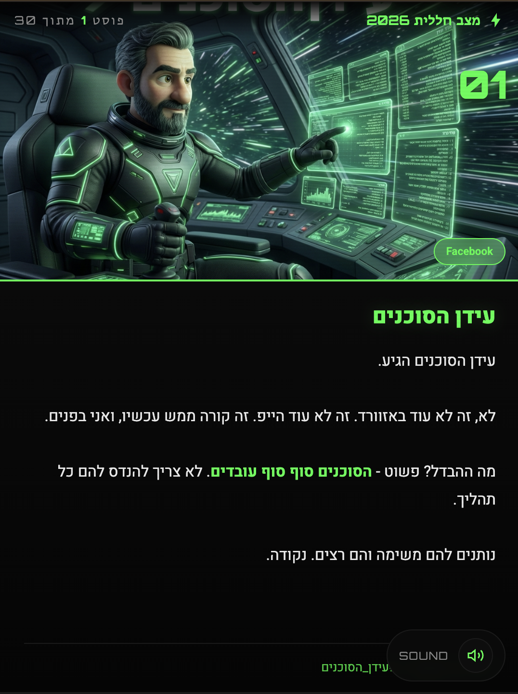

# פרק 1: I Love You Terminal - מה זה קלוד קוד ולמה דווקא בטרמינל

## הוק (15 שניות)

אם אתם חושבים ש-Claude Code זה כלי למתכנתים -
אתם טועים.

ו"קוד" בשם? זה מטעה לחלוטין.

---

## הבעיה עם AI עד היום (60 שניות)

### משל הדוקטור הגאון

דמיינו דוקטור - הכי חכם בעולם.
אבל כל בוקר הוא מתעורר ושוכח הכל:

- מי המטופלים שלו?
- מה הטיפולים שנתן אתמול?
- מה ההיסטוריה הרפואית?
- מה התוכניות לשבוע הבא?

**האם הייתם רוצים שהוא יטפל בכם?**

זה בדיוק ChatGPT, Gemini, כל ה-AI שאתם מכירים.
חכמים מאוד. **שוכחים הכל כל שיחה**.

---

## מה שונה ב-Claude Code? (90 שניות)

### מילה אחת: Context

Claude Code לא רק חכם - הוא **יושב על הקבצים שלכם**.

זה אומר:
- הוא רואה את המסמכים שלכם
- הוא יודע מה עשיתם אתמול
- הוא מכיר את הלקוחות שלכם
- הוא זוכר את הסגנון שאתם אוהבים

**הפרומפט שאף AI אחר לא יכול לבצע:**

> "שלח לחיים את הצעת המחיר שהוצאנו אתמול,
> תזכיר לו עוד 10 דקות בוואצאפ,
> הכן את החוזה ללקוח האחר,
> ושלח לי טיוטה לאישור."

**למה ChatGPT נכשל?**
- לא יודע מי זה "חיים"
- לא יודע איפה הצעת המחיר
- לא יכול לשלוח וואצאפ
- מתחיל מאפס כל פעם

**למה Claude Code מצליח?**
- יושב על תיקיית הפרויקט שלכם
- מכיר את כל הקבצים והלקוחות
- מחובר לכלים (מייל, וואצאפ, PDF)
- צובר ידע לאורך זמן

---

## למה טרמינל? (60 שניות)

אני יודע, טרמינל נשמע מפחיד.
מסך שחור עם אותיות לבנות.
"זה למתכנתים".

אבל הנה האמת:

### מה הטרמינל נותן ל-Claude Code:

1. **גישה ישירה לקבצים** - לא דרך ממשק מוגבל
2. **יכולת להריץ כלים** - Python, Node, ffmpeg, כל דבר
3. **חופש פעולה** - לא מוגבל לכפתורים שמישהו בנה
4. **מהירות** - בלי לחכות לטעינת דפים

### האנלוגיה:

GUI (ממשק גרפי) = לנסוע במונית
- נוח, אבל מוגבל לאן הנהג מוכן לקחת

Terminal = לנהוג בעצמך
- צריך רישיון, אבל יכול להגיע לכל מקום

**והנה הסוד:**

אתם לא צריכים לדעת לנהוג.
**Claude Code נוהג בשבילכם.**

אתם רק אומרים לאן.

---

## מה Claude Code באמת עושה? (45 שניות)

בואו נשבור מיתוסים:

| מה חושבים | מה באמת |
|-----------|---------|
| רק למתכנתים | לכל מי שרוצה לעבוד חכם |
| צריך לכתוב קוד | מדברים בעברית רגילה |
| מסובך | אחרי 10 דקות - מבינים |
| יקר | $20 לחודש = פחות מקפה ביום |

**מה Claude Code באמת עושה:**

- קורא וכותב קבצים
- מריץ כלים ותוכנות
- מחובר לאינטרנט
- שולח מיילים ווואצאפ
- יוצר תמונות ומסמכים
- **עושה את זה לבד, בלי שתעצרו אותו**

---

## ההבדל המהותי (30 שניות)

| צ'אטבוט רגיל | Claude Code |
|--------------|-------------|
| עוזר לך לעשות | עושה בשבילך |
| מתחיל מאפס כל פעם | זוכר ולומד |
| מחכה להוראות | יוזם ופועל |
| מוגבל לשיחה | גישה למחשב שלך |

**זה לא AI assistant.**
**זה AI agent.**

---

## סגירה (15 שניות)

Claude Code זה לא כלי למתכנתים.
זה הצעד הבא של AI.

מעוזר שעוזר - לסוכן שעובד.

בפרק הבא נתקין ונתחיל לעבוד.

---

## הערות הפקה

- **אורך משוער:** 5-6 דקות
- **ויזואליה:**
  - משל הדוקטור - אנימציה או תמונה
  - השוואה צ'אטבוט vs Claude Code
  - טרמינל = "סוכן עם הגה"
- **טון:** מפרק מיתוסים, מרגיע, מעורר סקרנות
- **מוזיקה:** קלילה, לא דרמטית
